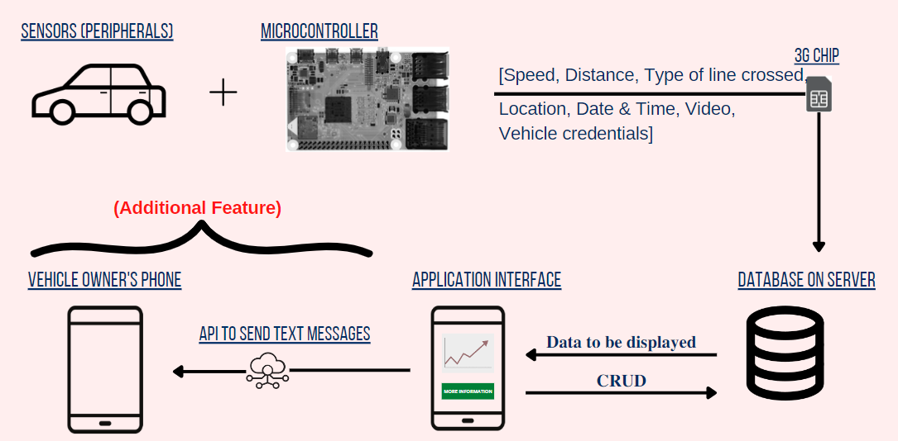
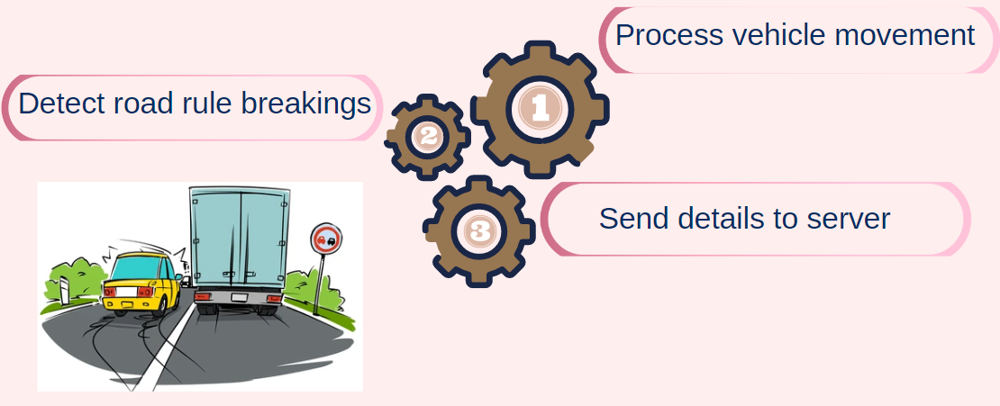
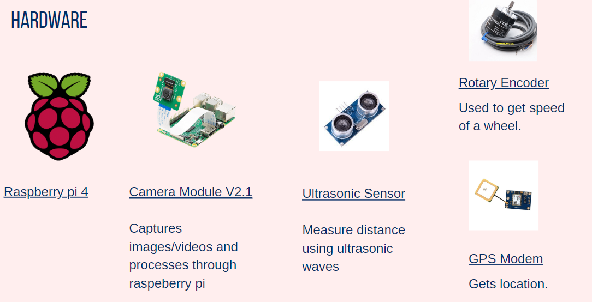
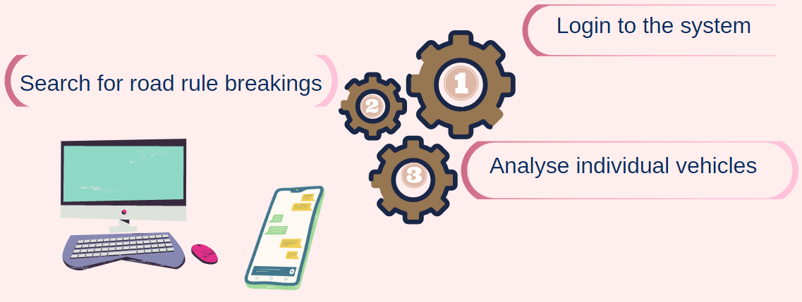

[comment]: # "This is the standard layout for the project, but you can clean this and use your own template"

# Automated Road Rule Detector

---

## Team
-  E/18/147, Jameel S. [e18147@eng.pdn.ac.lk](mailto:name@email.com)
-  E/18/242, Nimnadi J.A.S. [e18242@eng.pdn.ac.lk](mailto:name@email.com)
-  E/18/379, Wanduragala T.D.B. [e18379@eng.pdn.ac.lk](mailto:name@email.com)

<!-- Image (photo/drawing of the final hardware) should be here -->

<!-- This is a sample image, to show how to add images to your page. To learn more options, please refer [this](https://projects.ce.pdn.ac.lk/docs/faq/how-to-add-an-image/) -->

<!--  -->

#### Table of Contents
1. [Introduction](#introduction)
2. [Solution Architecture](#solution-architecture )
3. [Hardware & Software Designs](#hardware-and-software-designs)
4. [Testing](#testing)
5. [Detailed budget](#detailed-budget)
6. [Conclusion](#conclusion)
7. [Links](#links)

## Introduction

Road accidents are ever increasing in number. It has been reported that the average death rate due to accidents on the road is 6 people a day. It is also noted that over 1000 road accidents happen in a week. Although policemen are on the look for those who drive recklessly and there is a heavy fining system for road traffic related incidents, we see that these existing solutions prove to be ineffective. 

Another problem with the existing solution is that most drivers obey rules only when they see an official (policeman) on the road. This most definitely does not and will not solve the problems we face on the road.

Therefore, we propose a system that will be mounted onto a vehicle that senses its speed, line crossing and the distance from the vehicle to an incoming vehicle on the other lane while crossing a line. All these sensed details will be used to determine the severity of the vehicle’s road-lines based road rule breakage.

The details we gather will then be made available to the use of the motor traffic department/ police for further analysis of drivers and having them face consequences accordingly. 

## Solution Architecture

The microcontroller and its peripherals (sensors) will sense the speed, the type of line crossed by the vehicle and the distance from the vehicle to an incoming vehicle on the other lane. 

These information will be then sent to the database only when a line is crossed on the road. In the backend we will perform computations to determine the severity of the crossing of a road line and the road rule breakage.

Finally, in our application, necessary details will be displayed for all drivers in the form of a plot. Motor traffic related authorities will then be able to asses the drivers automatically.

## Hardware and Software Designs

### Hardware Design

#### Hardware Technologies

### Software Design

#### Software Technologies

## Testing

Testing done on hardware and software, detailed + summarized results

## Detailed budget

All items and costs

| Item          | Quantity  | Unit Cost  | Total  |
| ------------- |:---------:|:----------:|-------:|
| Raspberry Pi 4 model B - 2GB RAM   | 1         | 26,000 LKR     | 26,000 LKR |
| Raspberry Pi 4 CSI Camera Module   | 1         | 8,000 LKR     | 8,000 LKR |
| Rotary Encoder   | 1         | 3,500 LKR     | 3,500 LKR |
| GPS modem   | 1         | 1,790 LKR     | 1,790 LKR |
| Ultrasonic Sensor HC-SR04   | 1         | 450 LKR     | 450 LKR |
| Power Supply 9V battery  | 1         | 230 LKR     | 230 LKR |
| **Total** |          |      | **39, 970 LKR** |

## Conclusion

What was achieved, future developments, commercialization plans

## Links

- [Project Repository](https://github.com/cepdnaclk/e18-3yp-Automated-Road-Rule-Detector)
- [Project Page](https://cepdnaclk.github.io/e18-3yp-Automated-Road-Rule-Detector)
- [Department of Computer Engineering](http://www.ce.pdn.ac.lk/)
- [University of Peradeniya](https://eng.pdn.ac.lk/)

[//]: # (Please refer this to learn more about Markdown syntax)
[//]: # (https://github.com/adam-p/markdown-here/wiki/Markdown-Cheatsheet)
